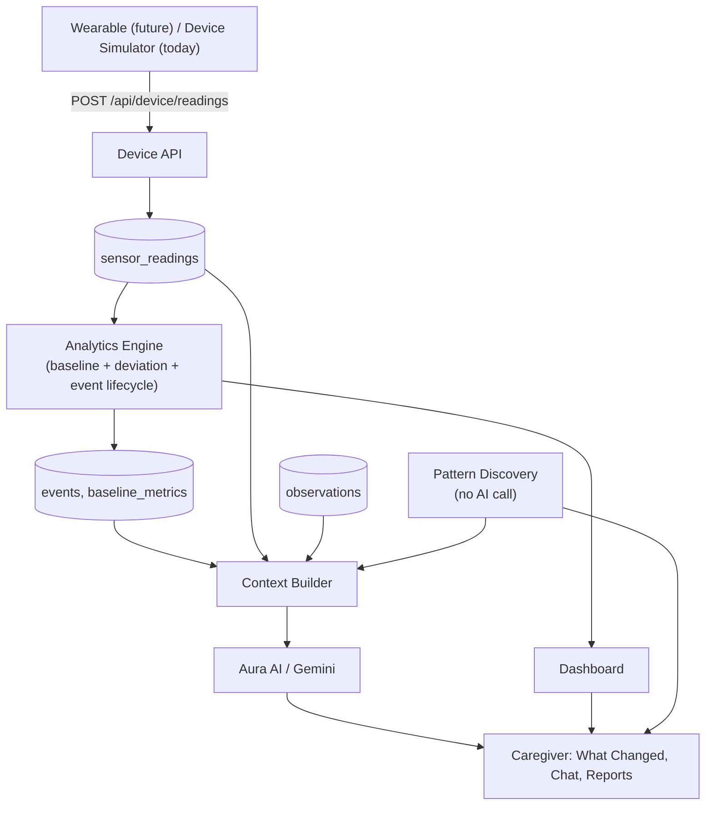

# AuraLink Care

**From signals to understanding.**

Built for **VentureHack 2026**.

AuraLink Care is an assistive monitoring and communication system for
caregivers of people with Autism Spectrum Disorder (ASD). It combines
physiological signals, a personal baseline, recorded history, and
caregiver context into AI-assisted explanations a caregiver can actually
act on — not a diagnostic tool, and never claims to prove an emotion or a
cause. See "Responsible AI" below.

## Problem

People may have difficulty communicating discomfort or sensory overload
before others recognize it, leaving caregivers reacting after the fact,
without the context to understand what happened or why.

## Solution

```
Old approach:  Sensor → AI → "Stress"
AuraLink:      Signals → compare with personal baseline → retrieve
               history/context → identify patterns → Aura AI →
               understandable explanation + appropriate next actions
```

Every physiological reading is compared only against **that person's own**
recent history — never a population average — and combined with caregiver
observations and known support strategies before Aura AI ever sees a
question about it.

## Architecture



Full write-up, folder structure, and the server/client security boundary:
**`docs/ARCHITECTURE.md`**.

## Tech stack

Next.js 16 (App Router) · TypeScript · Tailwind v4 · shadcn/ui (Radix) ·
Supabase Postgres + Auth + Row Level Security · Google Gemini
(`@google/genai`) · Recharts · Zod · Vitest · Vercel.

## Features (what actually works today)

- **Real accounts** — sign up, log in, log out, reset/change password, all
  via Supabase Auth.
- **Onboarding** — a 5-step wizard (basic profile, sensitivities, support
  strategies, routine, baseline setup) that creates a care profile.
- **Dashboard** — a live status (Calm / Mild Elevation / Elevated / High
  Elevation / Recovering / Insufficient Data), computed fresh on every
  load from stored sensor readings and that profile's own baseline.
- **Device Simulator** — sends real HTTP packets to the same ingestion
  endpoint a physical wearable would use (`POST /api/device/readings`);
  nothing here is a fake React state change.
- **What Changed?** — a one-click, Gemini-backed explanation of a
  deviation, grounded in that profile's own history.
- **Aura AI chat** — a persistent, profile-aware conversation, not a
  generic chatbot.
- **Timeline** — merges sensor events, caregiver observations, and Aura AI
  insights into one chronological view per day.
- **Patterns** — time-of-day clustering, context associations, and
  recovery-speed comparisons, computed with plain arithmetic over stored
  data. No AI call — stays available even if Gemini is down.
- **Reports** — Daily Summary and Weekly Aura Report, deterministic,
  printable.
- **Privacy controls** — export or permanently delete a profile's data.

See `docs/ARCHITECTURE.md` "What's simulated vs. real" for exactly what's
live vs. planned.

## AI architecture

Covered in depth in **`docs/AI_SYSTEM.md`**: the Personal Baseline Engine
(the deterministic prototype algorithm behind every status/deviation
number) and Aura AI (the Context Builder, guardrails, structured output,
and failure handling).

## Database architecture

Covered in depth in **`docs/DATABASE.md`**: the 15-table schema, why care
profiles are separate from accounts, the `events` lifecycle, and how Row
Level Security is structured.

## Security

Covered in depth in **`docs/SECURITY.md`**, including an honest list of
what isn't hardened yet (CSRF on plain API routes, rate limiting, audit
logging).

## Responsible AI

AuraLink Care is **not a diagnostic tool**. It never claims certainty about
an emotion, never claims correlation is causation, and never invents a
reading, event, or observation that isn't in its own database. Every
AI-derived statement in the UI is tagged as Measured, Calculated, Observed,
or Inferred. Full detail in `docs/AI_SYSTEM.md` and `docs/JUDGE_QA.md`.

## Device Simulator

There is no physical AuraLink wearable yet. The Devices page
(`/devices`) simulates the packets one would send: presets for Calm, Mild
Elevation, High Elevation, and Recovery, plus manual sliders for each
metric. **Send Sensor Packet** posts to the real ingestion endpoint, which
validates, persists, and runs the same analysis a live device's data
would. See the route's own docstring
(`src/app/api/device/readings/route.ts`) for exactly what a real device
integration would need to add (its own authentication).

## Getting started

### 1. Prerequisites

- Node.js 20.9+ (Node 22 recommended — this repo was built against it)
- A [Supabase](https://supabase.com) project (free tier is enough)
- A [Google Gemini API key](https://aistudio.google.com/apikey) (optional
  — the app runs and is fully demoable without one; Aura AI shows an
  honest "unavailable" state instead)

### 2. Install

```bash
npm install
```

### 3. Environment variables

```bash
cp .env.local.example .env.local
```

Fill in:

| Variable | Where to get it |
|---|---|
| `SUPABASE_URL` | Supabase dashboard → Project Settings → API |
| `SUPABASE_ANON_KEY` | same page |
| `SUPABASE_SERVICE_ROLE_KEY` | same page — **server-only, never commit this** |
| `GEMINI_API_KEY` | [aistudio.google.com/apikey](https://aistudio.google.com/apikey) — optional |
| `GEMINI_MODEL` | defaults to `gemini-3.6-flash` if unset |

### 4. Set up the database

In the Supabase SQL Editor (or via the Supabase CLI if you have it
linked), run the three files in `supabase/migrations/` **in order**:

```
20260922100000_schema.sql
20260922100100_functions_triggers.sql
20260922100200_rls.sql
```

Then regenerate types to match (optional but recommended if you change the
schema further):

```bash
supabase gen types typescript --linked > src/types/database.ts
```

### 5. Run locally

```bash
npm run dev
```

Open [http://localhost:3000](http://localhost:3000), sign up, and complete
onboarding with "Seed 7 days of demo data" checked — this is the easiest
way to see the Dashboard, Timeline, and Patterns populated immediately.

### 6. Seed (or re-seed) demo data via CLI

To re-seed an existing care profile (e.g. after "Delete My Data," or to
refresh a demo profile before a repeat presentation) without repeating
onboarding:

```bash
npm run seed -- <careProfileId>
```

(Find a care profile's ID via the Supabase table editor, or your browser's
network tab on any authenticated page.)

### 7. Checks before you consider anything "done"

```bash
npm run lint
npx tsc --noEmit
npm run build
npm run test
```

All four currently pass clean on this codebase.

### 8. Deploy to Vercel

1. Push this repository to GitHub.
2. Import it in Vercel.
3. Add the same environment variables from `.env.local` in the Vercel
   project's Environment Variables settings.
4. Deploy — no other configuration needed; this is a standard Next.js App
   Router project.

## Known MVP limitations

- No physical wearable — see "Device Simulator" above.
- The Personal Baseline Engine is explicitly a documented prototype
  algorithm, not a clinically validated model (`docs/AI_SYSTEM.md`).
- No real-time push — the dashboard re-fetches on navigation, not via a
  websocket/subscription. Send a packet, then navigate to Dashboard (or
  refresh) to see it update.
- Specialist role exists in the data model (`profile_access`, `role`
  column) but has no dedicated UI yet — a specialist currently sees the
  same caregiver interface for any profile shared with them.
- No CSRF token or rate limiting on the plain API routes yet; no audit
  log. See `docs/SECURITY.md` for the honest list.
- PDF export is via the browser's native print dialog ("Print / Save as
  PDF" on the Reports page), not a server-generated PDF file.

## Future development

- Replace the prototype baseline algorithm with a trained model once
  real-world data and clinical input are available (the module boundary
  in `lib/analytics/baseline-engine.ts` is designed for exactly this swap).
- Real wearable integration with per-device authentication.
- Live/real-time dashboard updates.
- A dedicated specialist view.
- Rate limiting, CSRF hardening on API routes, and an audit log.

## Documentation index

| Doc | Covers |
|---|---|
| `docs/ARCHITECTURE.md` | System design, folder structure, what's real vs. simulated |
| `docs/AI_SYSTEM.md` | Baseline engine math, Aura AI pipeline, guardrails |
| `docs/DATABASE.md` | Schema, RLS design, the service-role client |
| `docs/SECURITY.md` | Auth, secrets, input validation, what isn't hardened yet |
| `docs/DEMO_SCRIPT.md` | The 2–3 minute walkthrough |
| `docs/JUDGE_QA.md` | Direct answers to the hard questions |

## Team & contribution

Built solo for VentureHack 2026 with Claude Code (Anthropic) as a
pair-programming/architecture partner — every file in this repository was
generated through that collaboration and reviewed for correctness against
this README's own claims (see the git history for the phase-by-phase
build order). Add your name(s)/roles here if this is presented as a team
submission.
