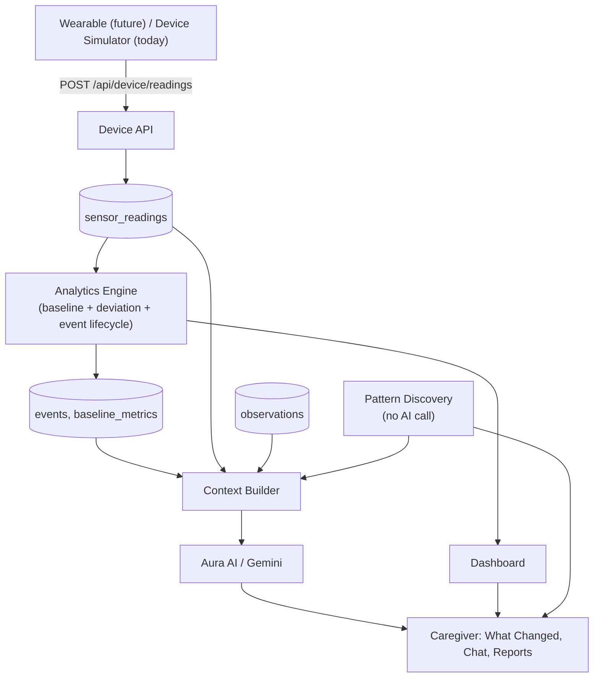

# Architecture

## Conceptual flow



Everything left of the Context Builder works without Gemini. Everything
right of it degrades to an honest "temporarily unavailable" message if
Gemini is down — see "AI failure fallback" below.

## Tech stack

| Layer | Choice | Why |
|---|---|---|
| Frontend | Next.js 16 (App Router), TypeScript, Tailwind v4 | Server Components mean most data-fetching pages ship zero client JS for the fetch itself; Server Actions replace a separate API layer for mutations |
| UI kit | shadcn/ui (Radix base) | Owns the component code (not a black-box dependency); consistent with the custom claymorphism design layer |
| Database | Supabase Postgres | Real relational DB + Row Level Security in one hosted product, free tier is enough for a hackathon judge to spin up in minutes |
| Auth | Supabase Auth | Cookie-based sessions via `@supabase/ssr`, integrates directly with Postgres RLS via `auth.uid()` |
| AI | Google Gemini (`@google/genai`) | Structured JSON output (`responseJsonSchema`) lets us validate every response against the same Zod schema sent to the model |
| Charts | Recharts | Small multiples (see Dashboard) rather than a single dual-axis chart |
| Validation | Zod | One schema per entity, shared between forms and API routes |
| Deployment | Vercel | Zero-config Next.js hosting; Supabase and Gemini are both reachable over plain HTTPS from serverless functions |

## Folder structure

```
src/
  app/
    (marketing)-equivalent: app/page.tsx        # public landing page
    (auth)/                                     # login, signup, reset, update-password
    (app)/                                      # authenticated area (has its own layout.tsx guard)
      dashboard/ timeline/ patterns/ aura-ai/ reports/ care-profile/ devices/ settings/
    api/
      device/readings/route.ts                  # sensor ingestion
      ai/{chat,what-changed}/route.ts
      export/route.ts
    auth/actions.ts, auth/callback/route.ts      # Server Actions + OAuth-style callback
    care-profile/actions.ts, tag-actions.ts
    observations/actions.ts
  components/                                   # UI, grouped by feature area
  lib/
    supabase/{client,server,admin}.ts           # three distinct Supabase clients
    analytics/{baseline-engine,analysis-engine}.ts
    patterns/{pattern-engine,pattern-utils}.ts
    ai/{context-builder,gemini-client,guardrails,response-schema}.ts
    validation/                                  # Zod schemas
    demo/{seeded-random,simulator-presets}.ts
    care-profile/active.ts, session.ts, env.ts, site-url.ts, utils.ts
  services/                                       # DB-touching orchestration, one file per entity
  types/{database,domain}.ts
  proxy.ts                                        # Next.js 16's renamed middleware.ts
supabase/migrations/                              # versioned SQL schema + RLS
scripts/                                          # (reserved — see README "seeding" section)
docs/                                              # this documentation set
```

**`lib/` vs `services/`:** `lib/` holds logic that doesn't necessarily touch
the database (validation, pure math, the Gemini client) or is a thin
wrapper around Supabase itself. `services/` holds the orchestration that
combines a validated input with one or more database calls for a specific
entity (`services/care-profiles.ts`, `services/sensor-ingestion.ts`, ...).
API routes and Server Actions are intentionally thin — they parse/validate
input, call a service function, and shape the HTTP response; the actual
logic lives in `lib/`/`services/` where it's independently testable.

## Server/client boundary

- Every Supabase call in a Server Component, Server Action, or Route
  Handler uses `lib/supabase/server.ts` — a client bound to the request's
  session cookies, so every query is automatically scoped by Row Level
  Security as that user.
- `lib/supabase/admin.ts` (the service-role client) and `lib/env.ts` both
  start with `import "server-only"`, which makes it a **build error** (not
  just a lint warning) to import them from a `"use client"` file. The
  production build (`npm run build`) is proof this boundary holds today —
  it would fail otherwise.
- There is no browser-side Supabase client in this app at all — every
  read/write goes through `lib/supabase/server.ts`. That's why the Supabase
  URL/anon key are plain `SUPABASE_URL`/`SUPABASE_ANON_KEY` env vars, not
  `NEXT_PUBLIC_`-prefixed: nothing needs them inlined into client-side JS.
  See `docs/SECURITY.md` "Why the anon key isn't `NEXT_PUBLIC_`-prefixed
  here" for the reasoning and what would need to change if that ever does.

## What's simulated vs. real (read this before a judge asks)

| Piece | Status |
|---|---|
| Authentication, account isolation, RLS | **Real** — a real Supabase project, real Postgres policies |
| Sensor data | **Simulated** — no physical wearable exists yet; the Device Simulator sends real HTTP requests to a real ingestion endpoint, which does real validation, real persistence, and real analysis |
| Baseline/deviation scoring | **Real computation, prototype algorithm** — genuinely computed from stored data on every request; the formula itself (weighted z-scores) is a documented starting point, not a clinically validated model (see `docs/AI_SYSTEM.md`) |
| Pattern Discovery | **Real computation** — arithmetic over stored `events`/`observations`, no templating, no AI call |
| Aura AI (chat, What Changed) | **Real Gemini calls**, grounded in a per-request context object built from real stored data; fails honestly if Gemini is unreachable or no API key is configured |
| Reports | **Real computation**, snapshotted to the database on each view |
| Device-token authentication for a real wearable | **Planned, not built** — today, sensor ingestion authenticates via the caregiver's own logged-in session (see `docs/SECURITY.md`); a physical device has no browser session, so it would need its own credential scheme, which is the one part of the ingestion path designed to change (see `src/app/api/device/readings/route.ts`'s docstring) |
| Specialist role UI | **Data model exists (`profile_access`, `specialist` role), no dedicated UI** — a specialist would currently use the same caregiver UI for any profile shared with them; a role-specific view is future work |

## AI failure fallback

If `GEMINI_API_KEY` is unset or Gemini returns an error, `generateStructured`/
`generateText` (`lib/ai/gemini-client.ts`) return a typed failure instead of
throwing. Every caller (What Changed, Chat) shows an explicit "Aura AI is
temporarily unavailable" state — never a fabricated response. Dashboard,
Timeline, Patterns, and Reports don't call Gemini at all, so they're
unaffected by an AI outage. This is verifiable by removing `GEMINI_API_KEY`
from `.env.local` and confirming Patterns/Reports/Dashboard are unchanged
while Aura AI shows the fallback message.
